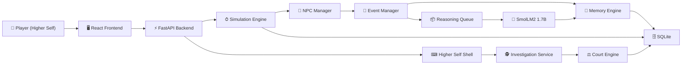

<div align="center">

# 🌆 EchoCity
### *An AI-Powered Living Civilization Where Every Citizen Thinks, Remembers, Gossips, and Evolves.*

[](https://python.org)
[](https://fastapi.tiangolo.com/)
[](https://react.dev/)
[](https://www.typescriptlang.org/)
[](https://sqlite.org/)
[](https://huggingface.co/HuggingFaceTB/SmolLM2-1.7B)
[](#)

---

### 🏆 Built for **OSDHack'26 – On Device AI**

### 🧠 Local-First AI • Deterministic Simulation • Multi-Agent Civilization

🎥 **Demo Video**

https://drive.google.com/file/d/1QHvUb33w7931BZSNXXlqqWqLhtbLQWSh/view?usp=sharing

</div>

---

# 🌍 What is EchoCity?

EchoCity is a **living AI civilization simulator** where every citizen possesses memories, relationships, emotions, routines, and evolving beliefs.

Instead of scripting NPC behavior, EchoCity combines a **deterministic world simulation** with **on-device language models** to create believable social interactions while remaining fully local and privacy-friendly.

As the **Higher Self**, you do not directly control citizens.

Instead, you subtly influence their thoughts, memories, and emotions, allowing complex social behaviors to emerge naturally over time.

---

# ✨ Key Features

## 🧠 Living AI Citizens

Every citizen maintains their own:

- Memories
- Relationships
- Emotional state
- Inventory
- Goals
- Daily routines
- Trust levels
- Conversation history

Each citizen evolves independently throughout the simulation.

---

## ⚙️ Deterministic Simulation Engine

The world continuously advances using a deterministic simulation loop.

It manages:

- Time progression
- NPC schedules
- Events
- Crime generation
- Gossip
- Conversations
- Court proceedings

This ensures reproducible world behavior while allowing AI to reason only where necessary.

---

## 🤖 Local AI Reasoning

EchoCity runs entirely with a **local SmolLM2 1.7B model**.

AI is used only for cognitive tasks such as:

- NPC reasoning
- Conversation generation
- Memory compression
- Context-aware responses

Routine operations remain deterministic for speed and consistency.

---

## 🧩 Higher Self System

Influence the city without directly controlling it.

Available influences include:

- Suggest
- Warn
- Comfort
- Encourage
- Remember
- Coincidence

These interventions subtly alter the simulation while preserving believable emergent behavior.

---

## 🕵 Investigation & Court System

Investigate crimes by:

- Questioning citizens
- Collecting evidence
- Inspecting memories
- Building a case
- Accusing suspects

The Court Engine evaluates evidence and determines the final verdict.

---

## 🧠 Persistent Memory System

Citizens remember:

- Conversations
- Crimes
- Discoveries
- Observations
- Influences
- Social interactions

Memories naturally spread through conversations, allowing information to propagate across the city.

---

## 💻 Interactive Observatory

Monitor the civilization through an immersive dashboard featuring:

- Citizen profiles
- Relationship graph
- Stream of consciousness
- Event timeline
- Higher Self terminal
- World clock

---

# 📸 Screenshots

<div align="center">


</div>

---

# 🛠 Tech Stack

## Backend

- Python 3.13
- FastAPI
- SQLite
- SQLAlchemy
- uv
- Pydantic

## Frontend

- React 19
- TypeScript
- Vite
- TailwindCSS

## AI

- SmolLM2 1.7B
- Local Inference
- Context Builder
- Prompt Templates

## Testing

- Pytest
- 194 Backend Tests

## Development

- Ruff
- pre-commit
- uv

---

# 📚 Documentation

Additional project documentation can be found in the repository:

- `deliverables/ARCHITECTURE.md`
- `deliverables/TECHNICAL_REPORT.md`
- `deliverables/EVALUATION.md`
- `deliverables/LOCAL_AI_VERIFICATION.md`
- `deliverables/PRIVACY_AND_SAFETY.md`
- `docs/DOCUMENTATION.md`

---


# 🏗 System Architecture

EchoCity follows a **hybrid architecture** that combines deterministic simulation with asynchronous local AI reasoning.

Rather than allowing an LLM to control the world directly, deterministic systems remain the source of truth while AI is used only for higher-level cognitive tasks.



---

# 🧠 AI Pipeline

EchoCity intentionally avoids using an LLM for everything.

Instead, every action follows one of two paths.

## Deterministic Path

Fast operations bypass AI completely.

Examples:

- NPC movement
- Daily schedules
- World clock
- Crime generation
- Location updates
- Inventory changes
- Court logic
- Memory storage

These operations execute instantly.

---

## AI Reasoning Path

Only tasks requiring reasoning are sent to the local language model.

Examples include:

- NPC conversations
- Memory compression
- Context-aware dialogue
- Cognitive decision making
- Player interactions

This dramatically reduces latency while keeping NPC behavior believable.

---

# 🏙 Core Backend Architecture

## 👥 NPC Manager

Maintains every citizen in the simulation.

Each NPC stores:

- Personality
- Goals
- Relationships
- Inventory
- Current location
- Emotional state
- Daily routine
- Memories

NPCs never call the LLM directly.

---

## 📢 Event Manager

Every important world action becomes an event.

Examples:

- Crime witnessed
- Conversation started
- Gossip spread
- Investigation progress
- Higher Self intervention

The Event Manager routes events to the correct subsystem.

---

## 🧠 Memory Engine

Every meaningful experience becomes structured memory.

Each memory contains information such as:

- Summary
- Source
- Subject
- Timestamp
- Confidence
- Type

These memories become the foundation for future reasoning and conversations.

---

## 💬 Gossip Engine

Citizens naturally spread information through conversations.

Information propagation happens by:

1. Citizens meeting
2. Selecting memories
3. Sharing knowledge
4. Creating new memories for listeners

This allows knowledge to diffuse across the city without scripted behavior.

---

## 🤖 AI Router

Acts as the gateway between deterministic systems and the local LLM.

Responsibilities include:

- Deciding whether AI is required
- Routing reasoning requests
- Skipping unnecessary inference
- Reducing CPU usage

---

## 📦 Reasoning Queue

All AI tasks are processed asynchronously.

Benefits include:

- Non-blocking simulation
- Prioritized reasoning
- Smooth world updates
- Stable performance on local hardware

---

## ⚖ Court Engine

Handles investigations and verdicts.

Players can:

- Gather evidence
- Question citizens
- Build a case
- Accuse suspects

The court evaluates collected evidence before returning a verdict.

---

# 🌐 Frontend

The frontend acts as a real-time observatory into the simulation.

It provides multiple interactive windows for monitoring the city without exposing implementation complexity.

Current interface includes:

- Citizen Profiles
- Relationship Graph
- Stream of Consciousness
- Event Timeline
- Higher Self Terminal
- World Clock
- Investigation Interface

The UI follows a cyberpunk-inspired glassmorphism design with draggable windows and an immersive desktop-like experience.

---

# ⚡ Higher Self Commands

The player influences EchoCity through a built-in terminal.

| Command | Description |
|----------|-------------|
| `inspect <agent>` | View detailed citizen information |
| `question <agent>` | Question a citizen |
| `observe <location>` | Observe a location |
| `suggest <agent>` | Plant a subtle idea |
| `warn <agent>` | Warn a citizen |
| `comfort <agent>` | Calm a citizen |
| `encourage <agent>` | Encourage confidence |
| `remember <agent> <memory>` | Resurface an existing memory |
| `coincidence <agent> <memory>` | Make an old memory unexpectedly resurface |
| `collect <agent> <memory>` | Collect evidence |
| `accuse <agent>` | Begin court proceedings |
| `ls`, `cd`, `tree` | Navigate the investigation shell |

---

# 📂 Repository Structure

```text
EchoCity
│
├── backend/
│   ├── app/
│   │   ├── agents/
│   │   ├── api/
│   │   ├── bootstrap/
│   │   ├── conversation/
│   │   ├── core/
│   │   ├── court/
│   │   ├── crime/
│   │   ├── database/
│   │   ├── events/
│   │   ├── higher_self/
│   │   ├── investigation/
│   │   ├── llm/
│   │   ├── memory/
│   │   ├── shell/
│   │   └── simulation/
│   │
│   ├── scripts/
│   └── tests/
│
├── frontend/
│
├── frontend_old/
│
├── deliverables/
│
├── docs/
│
├── EchoCity_NPC_Bible.md
│
└── README.md
```

---

# 🧪 Testing

EchoCity has an extensive backend test suite covering all major subsystems.

**Current Test Coverage**

- Agent Management
- Memory Engine
- Conversation Engine
- Gossip Engine
- Higher Self
- Event System
- Court Engine
- Crime Engine
- Investigation Service
- Simulation Engine
- AI Router
- Scheduler
- Parser
- Shell
- World Integration
- Database Components

✅ **194 backend tests passing**

---

# 🚀 Getting Started

## Prerequisites

Before running EchoCity, install:

- Python **3.13+**
- Node.js **18+**
- Git
- **uv** (Python package manager)
- Ollama

---

# 📦 Clone the Repository

```bash
git clone https://github.com/PushkarAgrawal17/EchoCity.git

cd EchoCity
```

---

# 🤖 Install the Local AI Model

EchoCity runs entirely with a **local language model**.

Start Ollama:

```bash
ollama serve
```

Pull the required model:

```bash
ollama pull smollm2:1.7b-instruct-q4_K_M
```

---

# ⚙ Backend Setup

Move into the backend directory:

```bash
cd backend
```

Create the virtual environment (first time only):

```bash
uv venv
```

Activate it

### Windows

```powershell
.venv\Scripts\activate
```

### Linux / macOS

```bash
source .venv/bin/activate
```

Install all dependencies

```bash
uv sync
```

---

# Configure Environment Variables

Create a `.env` file from the provided template.

```bash
cp .env.example .env
```

Edit values if necessary.

Typical configuration:

```env
OLLAMA_BASE_URL=http://localhost:11434

OLLAMA_MODEL=smollm2:1.7b-instruct-q4_K_M

DATABASE_URL=sqlite+aiosqlite:///./echocity.db
```

---

# ▶ Run the Backend

```bash
uv run uvicorn app.main:app --reload
```

Backend will start at

```
http://127.0.0.1:8000
```

---

# 🎨 Frontend Setup

Open another terminal.

```bash
cd frontend
```

Install dependencies

```bash
npm install
```

Run development server

```bash
npm run dev
```

Frontend will be available at

```
http://localhost:5173
```

---

# 🎮 Running EchoCity

1. Start Ollama

2. Start the backend

```bash
uv run uvicorn app.main:app --reload
```

3. Start the frontend

```bash
npm run dev
```

4. Open

```
http://localhost:5173
```

5. Observe your living civilization.

---

# 🧪 Running Tests

Run the complete backend test suite.

```bash
cd backend

uv run pytest
```

Expected output:

```
194 passed
```

---

# ✨ Code Quality

Run Ruff

```bash
uv run ruff check .
```

Auto-fix issues

```bash
uv run ruff check . --fix
```

Format code

```bash
uv run ruff format .
```

---

# 📁 Useful Scripts

Inside the backend directory:

### Hackathon Simulation

```bash
uv run python scripts/hackathon_simulation.py
```

Demonstrates:

- NPC simulation
- Events
- Memory generation
- AI reasoning
- Crime simulation

---

### AI Persistence Verification

```bash
uv run python scripts/verify_ai_persistence.py
```

Verifies:

- SQLite persistence
- AI integration
- Memory storage
- Database consistency

---

### Demo Script

```bash
uv run python scripts/demo.py
```

Runs a small demonstration of the backend systems.

---

# 🔍 API Health Check

Verify the backend is running:

```
GET /health
```

Example:

```
http://127.0.0.1:8000/health
```

---

# 🧩 Project Workflow

```
Player
      │
      ▼
Frontend Dashboard
      │
      ▼
FastAPI Backend
      │
      ▼
Simulation Engine
      │
      ├─────────────► Deterministic Systems
      │
      └─────────────► AI Router
                            │
                            ▼
                    SmolLM2 1.7B
                            │
                            ▼
                     Updated Memories
                            │
                            ▼
                    Living Civilization
```

---

# 💻 Development Workflow

After pulling new changes:

```bash
git pull

cd backend

uv sync

cd ../frontend

npm install
```

Run backend

```bash
cd backend

uv run uvicorn app.main:app --reload
```

Run frontend

```bash
cd frontend

npm run dev
```

Run tests before every commit

```bash
cd backend

uv run pytest

uv run ruff check .
```

---

# 📖 Documentation

Additional project documentation is available in:

```
deliverables/
├── ARCHITECTURE.md
├── EVALUATION.md
├── LOCAL_AI_VERIFICATION.md
├── PRIVACY_AND_SAFETY.md
└── TECHNICAL_REPORT.md

docs/
└── DOCUMENTATION.md
```

These documents provide deeper insight into the project's architecture, evaluation methodology, local AI implementation, privacy considerations, and technical design.

---

# 👥 Team

Built during **OSDHack'26 – On Device AI** by:

| Name | GitHub |
|------|---------|
| Pushkar Agrawal | [@PushkarAgrawal17](https://github.com/PushkarAgrawal17) |
| Hrishita Raj Singh | [@quaildev57](https://github.com/quaildev57) |
| Shivam Sharma | [@shivi5906](https://github.com/shivi5906) |
| Yash Upadhyay | [@upadhyay516](https://github.com/upadhyay516) |

---

# 🗺 Roadmap

### ✅ Completed

- Deterministic Simulation Engine
- NPC Manager
- Memory System
- Gossip Engine
- Conversation Engine
- Crime Engine
- Investigation System
- Court Engine
- Higher Self Influence System
- Local AI Integration
- AI Router
- Context Builder
- Prompt Builder
- Reasoning Queue
- FastAPI Backend
- React Frontend
- SQLite Persistence
- 194 Backend Tests
- Interactive Observatory Dashboard

---

### 🚧 Future Improvements

- Larger Local Language Models
- Richer Citizen Personalities
- Expanded City Scale
- Multi-day Story Arcs
- Dynamic Economy
- Procedural World Generation
- Save & Load Worlds
- Multiplayer Observer Mode
- Improved Visual Analytics
- Advanced Relationship Evolution

---

# 📊 Project Statistics

| Metric | Value |
|---------|------:|
| Citizens | 8 |
| Higher Self Commands | 12 |
| Backend Test Cases | **194** |
| Local LLM | SmolLM2 1.7B |
| Backend | FastAPI |
| Frontend | React + Vite |
| Database | SQLite |
| Package Manager | uv |

---

# 📂 Repository Highlights

```
backend/
├── Simulation Engine
├── Memory Engine
├── Conversation Engine
├── Gossip Engine
├── Crime Engine
├── Court Engine
├── Investigation Service
├── Higher Self
├── AI Router
├── Local LLM Integration
└── 194 Tests

frontend/
└── Interactive Observatory Dashboard

deliverables/
└── Project Documentation

docs/
└── Technical Documentation
```

---

# 🎯 Design Philosophy

EchoCity was designed around a simple principle:

> **Deterministic systems should control the world. AI should control only cognition.**

Instead of relying entirely on language models, EchoCity combines predictable simulation with selective AI reasoning.

This approach provides:

- Better performance
- Lower hardware requirements
- Greater determinism
- Consistent world state
- Fully local execution
- Privacy by design

The result is a simulation where AI enhances behavior without replacing the underlying game logic.

---

# 🔒 Privacy

EchoCity is designed to run **entirely on-device**.

- No cloud inference
- No external AI APIs
- No user data collection
- No telemetry
- Local SQLite database
- Local language model inference

Your simulation never leaves your computer.

---

# 🙌 Acknowledgements

Special thanks to:

- **OSDHack'26** for providing the challenge and opportunity to build EchoCity.
- The **FastAPI**, **React**, **SQLite**, and **Ollama** communities for their excellent open-source ecosystems.
- **SmolLM2** for enabling efficient on-device AI reasoning.

---

# 📜 License

This project is licensed under the **MIT License**.

See the [LICENSE](LICENSE) file for details.

---

<div align="center">

## ⭐ If you found EchoCity interesting, consider giving it a star!

It helps support the project and motivates future development.

[⬆ Back to Top](#echocity)

---

Made with ❤️ by the EchoCity Team

</div>