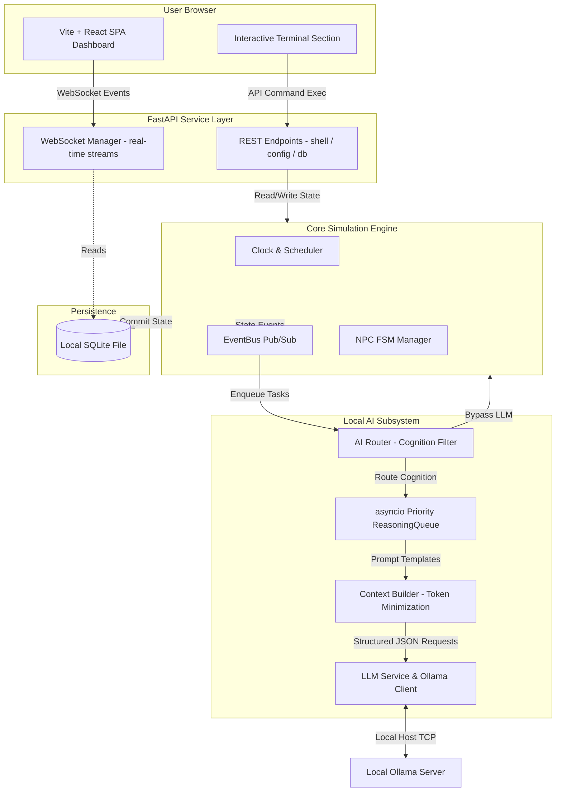
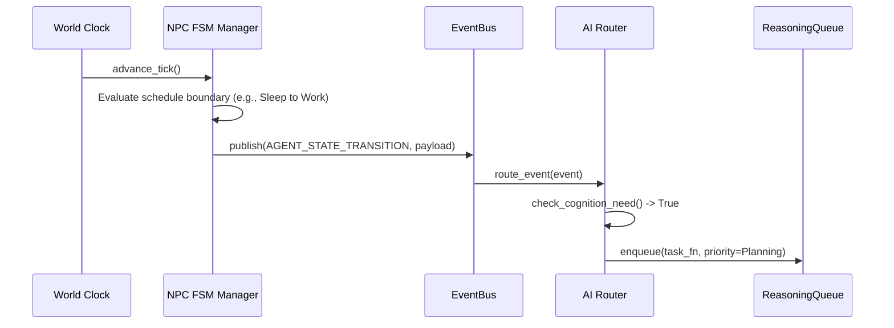
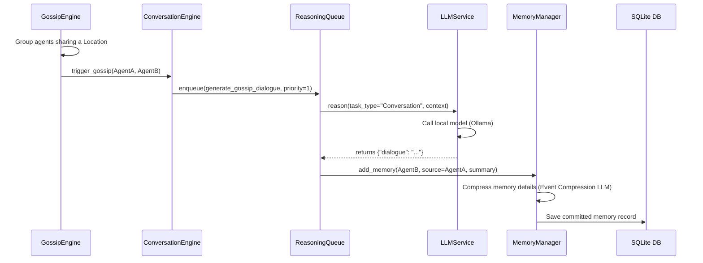

# EchoCity — System Architecture & Data Flow

This document details the software architecture, model pipeline, data flow sequences, component layout, and critical engineering decisions behind the offline EchoCity agentic runtime.

---

## 1. System Architecture Diagram

EchoCity is built with a decoupled three-tier architecture that runs entirely on the user's local machine. 

---

## 2. Component Boundaries & Layout

### A. Frontend (Vite React Client)
*   **Role**: Visualizes the simulation environment, agent states, gossip streams, and relationship matrices.
*   **Interactive Shell**: Contains the `TerminalSection` mimicking the backend parser, allowing players to issue raw commands.
*   **WebSockets client**: Connects directly to the backend ASGI server to receive realtime ticker logs, social event narratives, and diagnostic updates.

### B. FastAPI Server
*   **Role**: Serves API routes, handles connection configuration, manages client WebSockets, and handles CLI execution pipelines.
*   **Dependency Injection**: Structured using FastAPI `Depends` for modular service resolving (e.g. settings loading, database session management, simulation state references).

### C. Core World Engine
*   **Clock & Scheduler**: Keeps track of integer tick count. One tick corresponds to one simulated minute. The Scheduler uses a min-heap to trigger future NPC activities or events relative to the simulation clock, avoiding system-time drift.
*   **EventBus**: A synchronous, lightweight publisher-subscriber engine that acts as the messaging glue between modules. 
*   **NPC FSM Manager**: Maintains the state machine of each agent (`IDLE`, `WALKING`, `WORKING`, `SLEEPING`, `TALKING`). NPC schedule changes publish event signals to the EventBus.

### D. Local AI Pipeline
*   **AI Router**: Evaluates incoming questions/actions. Factual queries (e.g., location, job, inventory) bypass the LLM and fetch data directly from SQLite. Subjective or narrative queries are routed to the queue.
*   **Reasoning Queue**: An asynchronous `asyncio.PriorityQueue` running parallel worker loops. It enforces a strict concurrency cap (default: `2`) to prevent CPU cores from bottlenecking, and prioritizes critical player tasks (Priority 0) over background NPC planning (Priority 3).
*   **Context Builder**: Trims and compresses agent attributes, Big Five personality scales (e.g., `O:80, C:50`), nearby relationship stats, and historical memory counts to keep context sizes under **200 tokens**.
*   **LLM Service**: Connects to the local Ollama daemon via HTTP. Configured with a 30-second timeout, 0.3 temperature for consistency, and requests strict structured JSON payloads (`format="json"`).

---

## 3. Data Flow Sequences

### Sequence A: Clock Tick & Schedule FSM Transition
This sequence details how the world advances and triggers cognitive decisions:

### Sequence B: Asynchronous Gossip Memory Compression
This sequence details how NPCs talk to each other and compress dialogs into memories:

---

## 4. Key Design Decisions

1. **Decoupled FSM World Engine**: The simulation clock never blocks on LLM inference. If a local model takes 3 seconds to generate a dialogue, the main simulation tick continues running at its paced interval. The dialogue is spliced back into the feed once the async worker completes.
2. **Strict Concurrency Limit**: Consumer CPUs bottleneck when executing multiple LLM threads. EchoCity handles this by running a background worker pool with a concurrency limit of `2`.
3. **Factual Bypass Logic**: Eliminates LLM inference cost and latency for simple database queries. Checking what an NPC possesses or their occupation resolves in less than 2 milliseconds using SQL indexes, rather than 3 seconds through an LLM.
4. **Immutable State Records**: Subsystem models like `Memory`, `Location`, and `Evidence` are modeled as frozen dataclasses. They represent facts that cannot be altered mid-run, preventing state-sync bugs across async tasks.
