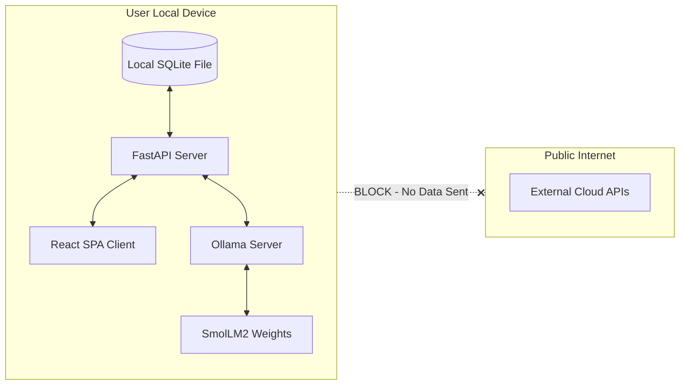

# EchoCity — Local AI & Offline Verification

This document verifies the local execution model of EchoCity. It outlines privacy boundaries, details network requirements, and provides steps to verify that the application runs 100% offline without transmitting data to external servers.

---

## 1. On-Device Execution Boundaries

EchoCity is built to be a self-contained environment. Every layer of the stack runs locally.



### Stack Boundaries
1.  **Simulation Engine & API Server**: FastAPI and Uvicorn bind exclusively to local loopback addresses (`127.0.0.1` / `localhost`). They do not expose ports to the public internet.
2.  **State Persistence**: Game states, agent profiles, relationships, and compressed memories are written to a local SQLite database file (`echocity.db`) in the `backend/` directory. No cloud database or sync services are configured.
3.  **Inference Server**: Ollama runs as a local background daemon. API calls are sent over standard HTTP to `http://localhost:11434` (local TCP connection), never crossing external gateways.

---

## 2. What Requires Internet?

An internet connection is required **only during the initial installation and configuration phase**:

| Action | Target | Host / Repository |
|---|---|---|
| **Python Setup** | `pip install -e .` | Python Package Index (PyPI) |
| **Node.js Setup** | `npm install` | npm Registry |
| **LLM Setup** | `ollama pull smollm2:1.7b-instruct-q4_K_M` | Ollama Library |

Once these dependencies and model files are downloaded, **no internet connection is required**. The game is fully functional in airplane mode.

---

## 3. Data Privacy and Safety Audit

*   **Zero External Requests**: The backend does not implement any HTTP client calls to external APIs. All outbound requests are addressed to localhost loopbacks (`http://localhost:11434` for Ollama).
*   **No User Telemetry**: EchoCity contains no tracking pixels, analytics suites (such as Google Analytics or Mixpanel), error reporting integrations (like Sentry), or crash log submitters.
*   **Prompt Containment**: Interrogations, override inputs, and custom agent nudges remain strictly within the local Ollama process context and are destroyed on session close or written only to the local SQLite database.

---

## 4. How to Verify 100% Offline Execution

You can audit the system's privacy and offline status by executing the following steps:

1.  **Disconnect Network Adapter**: Turn off your device's Wi-Fi and disconnect any Ethernet cables.
2.  **Clear Server Cache**: Restart your local Ollama daemon to clear any temporary active sessions.
3.  **Launch Backend & Frontend**:
    ```powershell
    # Terminal 1: Run Backend
    .\venv\Scripts\activate
    python -m uvicorn app.main:app
    
    # Terminal 2: Run Frontend
    npm run dev
    ```
4.  **Perform Gameplay Actions**:
    *   Open `http://localhost:5173` in your browser.
    *   Interact with the dashboard, clicking NPC cards.
    *   Open the Synaptic Override console and run a query:
        ```text
        question sophia_bennett "Tell me about the necklace theft."
        ```
    *   Observe the response returning locally.
5.  **Review System Logs**: Check the FastAPI console log. You will observe that all HTTP and WebSocket connections originate from `127.0.0.1`, verifying that no network packets are sent to external domains.
