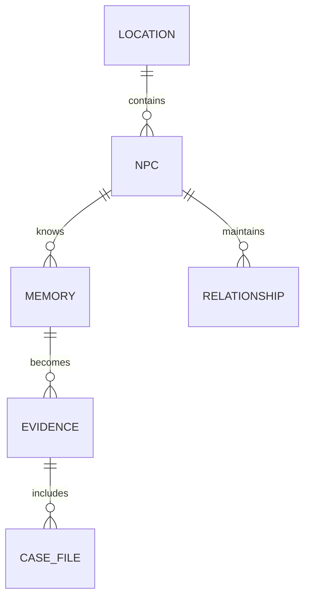

# EchoCity — Privacy, Security & Content Safety

This document outlines data governance policies, operating system permissions, storage layouts, limitations, and security mitigations of the EchoCity offline runtime.

---

## 1. Data Handling & Privacy Policy

EchoCity is built with a **Privacy-First Directive**:

*   **Zero Remote Tracking**: The application does not contact any external tracking, cloud backend, telemetry, or diagnostic servers.
*   **Fictional Context Isolation**: The application handles only fictional state variables (character names, locations, and dialogue regarding a fictional crime investigation). It never requests, parses, or stores any real-world user data (such as emails, names, or real locations).
*   **Prompt Sanitization**: User-entered override text and interrogation queries are processed on-device. No prompt histories are cached outside the local SQLite environment.

---

## 2. Operating System Permissions

EchoCity runs within a standard user space sandbox and does not require elevated or administrator permissions.

| Permission | Scope | Rationale |
|---|---|---|
| **Disk Read/Write** | Project Working Directory only | Used to read configuration files and write simulation state logs to the local `echocity.db` file. |
| **Local Port Binding** | Port `8000` (FastAPI) & `5173` (Vite) | Necessary to host the local API server and UI development server on the loopback adapter (`127.0.0.1`). |
| **Local HTTP Client** | Port `11434` (Ollama) | Required to transmit prompt JSON payloads to the locally running Ollama service. |

---

## 3. Storage Profile & Database Layout

All game states are saved inside the single-file database `echocity.db` located in the backend folder. This file utilizes a clean database schema:



*   **No PII (Personally Identifiable Information)**: Since the database stores only game states (character schedules, coordinate maps, relationship trust values, and fictional witness logs), no sensitive data is ever written to the disk.
*   **Manual Erasure**: Deleting the database and reset the game state takes a single action: deleting the `echocity.db` file from the disk. It is automatically recreated and re-seeded on the next backend boot.

---

## 4. Limitations & Safety Mitigations

### A. Fictional Narrative Safety
The local AI model generates dialogue and reasoning related to a criminal investigation scenario (e.g. Theft of the Silver Necklace).
*   *Safety Feature*: Prompt templates are engineered to prevent NPCs from generating physical violence, hate speech, or explicit content. All interactions are constrained to standard detective investigation dialogues.

### B. System Port Conflicts
If port `8000` (FastAPI), `5173` (Vite), or `11434` (Ollama) is already in use by another local application, EchoCity will fail to start.
*   *Mitigation*: The user can override ports by defining custom environment variables in the `.env` file:
    ```env
    API_PORT=8001
    OLLAMA_BASE_URL=http://localhost:11435
    ```
